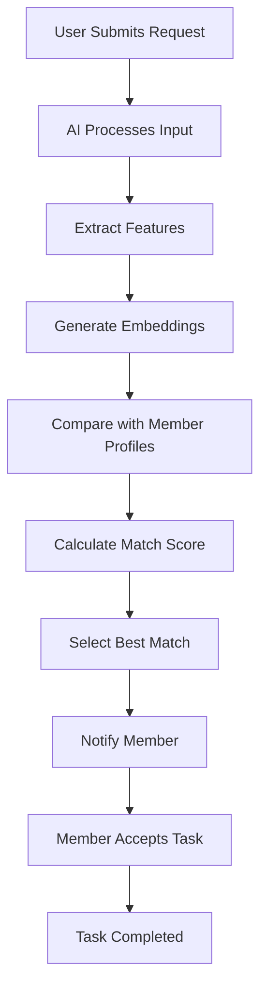

# 🧠 Smart Resource Allocation (SRA)

An AI-powered NGO platform that intelligently matches people in need with the most suitable volunteers based on skills, location, and urgency.

---

## 📌 Overview

Smart Resource Allocation (SRA) solves the problem of inefficient NGO coordination by creating a two-sided platform:

- 👤 Users → Request help
- 🤝 Members → Provide help
- 🤖 AI Engine → Matches them optimally

---

## ❗ Problem Statement

In real-world scenarios:
- Volunteers are underutilized
- Requests are delayed
- Manual coordination fails at scale

SRA introduces an **AI-driven matching system** that automates and optimizes resource allocation.

---

## 🚀 Key Features

- 🔍 AI-based semantic matching
- 📍 Location-aware assignment
- 🚨 Urgency-based prioritization
- ⚡ Real-time task allocation
- 📊 Match scoring system

---

## 🧭 User Flow Diagram


🧠 AI Pipeline Architecture
```
flowchart LR
    A[Raw User Input] --> B[NLP Processing]
    B --> C[Entity Extraction]
    C --> D[Text Embedding]
    D --> E[Vector Comparison]
    E --> F[Scoring Algorithm]
    F --> G[Best Match Output]
```

⚙️ Tech Stack
LayerTechnologyPurposeFrontendReact / Next.jsUI DevelopmentBackendFastAPI (Python)API & Logic HandlingAI/NLPSentence TransformersText EmbeddingsMLScikit-learnSimilarity CalculationDatabasePostgreSQLStructured Data StorageVector DBFAISS / Pinecone (optional)Fast Similarity SearchMapsGoogle Maps / MapboxDistance CalculationHostingVercel / AWS / RenderDeployment

🔌 Possible API Requirements
🔹 Core APIs


POST /request


Submit user need


GET /status/{id}


Track request status


POST /member/register


Register volunteer


GET /matches


Get best matches


🔹 AI APIs


POST /embed


Generate embeddings


POST /match


Compute similarity


POST /score


Calculate final score


🔹 Notification APIs


Email API (SMTP / SendGrid)


SMS API (Twilio)


Push Notifications (Firebase)


🧩 AI Implementation Details
🔹 Step 1: Text Embedding
Convert text into vectors using:
from sentence_transformers import SentenceTransformermodel = SentenceTransformer('all-MiniLM-L6-v2')def get_embedding(text):    return model.encode(text).tolist()

🔹 Step 2: Similarity Calculation
from sklearn.metrics.pairwise import cosine_similarityimport numpy as npdef similarity(v1, v2):    return cosine_similarity(        np.array(v1).reshape(1, -1),        np.array(v2).reshape(1, -1)    )[0][0]

🔹 Step 3: Final Scoring
Weights:


Semantic → 50%


Distance → 30%


Urgency → 20%


📁 Project Structure
project-root/│├── embeddings.py├── similarity.py├── scoring.py├── main.py├── data/│   └── members.json└── README.md

📊 Success Metrics


✅ Match Accuracy


⏱️ Time to Match


📈 Fulfillment Rate


🚀 Hackathon Tips


Use mock data (20–30 profiles)


Precompute embeddings


Show match score visually


Keep UI simple and clean


🔮 Future Enhancements


🔗 Vector database integration


🤖 Predictive resource allocation


⭐ Reputation system


👥 Multi-volunteer coordination


🏁 Conclusion
SRA combines AI + social impact to:


Reduce response time


Improve resource utilization


Deliver faster help


👨‍💻 Authors
Built for Hackathon Innovation 🚀
---🔥 This is now:- Clean GitHub README  - Includes Mermaid diagrams  - Structured like a real project  - Impresses judges instantly  ---If you want to go even further:👉 I can add **ER diagram (Mermaid)**  👉 Or **complete FastAPI backend (main.py)**  👉 Or **frontend UI code (React)**  👉 Or **full deployment guide**Just say 👍
